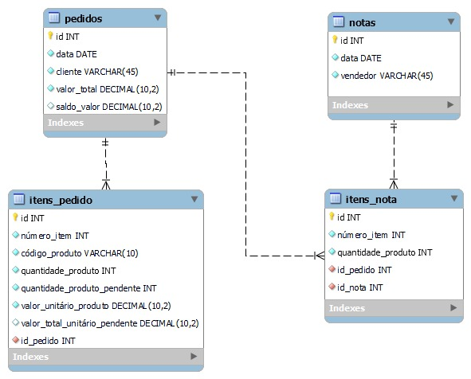

# Repositório do desafio técnico PortLuis.Tech

Repositório possui dois projetos para o desafio técnico o **backend-txt** foi o que me desafiaram fazer seguindo as orientações propostas, e o **backend-mysql** é como eu faria no dia a dia utilizando o banco de dados MySQL e o ORM Sequelize. Reforço que normalmente não crio repositórios com dois projetos, como podem olhar no meu [Git Hub][Git Hub-url], mas criei dessa forma para não correr o risco de não ver o com o MySQL. Abaixo segue o README referente a cada projeto.

<details>

  <summary>README do backend-mysql</summary>

# backend-mysql

 Repositório possuí projeto desenvolvido para o desafio técnico **PortLuis.tech**, abordando conceitos de `API REST` com CRUD completo utilizando arquitetura Model-Service-Controller (`MSC`), princípios de `POO` e `SOLID`, utilizando `JavaScript`, `express.js`, banco de dados relacional `MySQL`, ORM `Sequelize`, e `docker` para conteinerização.
 Para testes foram usados testes via `Mocha`, `Chai`, `Sinon`.

## Informações adicionais

- Projeto possui ideia de como eu faria a proposta passada, mas utilizando banco de dados MySQL ao invés de arquivos de texto. Reforço que segui o máximo possível o projeto original, mas que se fosse livre, criaria mais tabelas e mais relações para uma melhor organização e padronização.
- Projeto realizado em `JavaScript(es6)`;
- Para testes foram utilizados `Jest`, `Mocha`, `Chai` e `Sinon`;
- Para organização e padronização foi utilizado o `ESLint`;
- Para utilizar o MySQL foi utilizado docker para conteinerização do mesmo;
- Para validação foi utilizado o módulo Node.js [`AJV`](https://ajv.js.org/);
- Utilizei o modulo `fs` em sua versão assíncrona para não ter nenhum tipo de atraso na resposta. Coloquei uma resposta e uma criação de arquivo conforme a proposta inicial;
- Foi utilizadoCommonJS ao invés de ES6, por conta do Sequelize, funciona com uma melhor organização.

## Linguagens e ferramentas usadas

[![Git][Git-logo]][Git-url]
[![ESLint][ESLint-logo]][ESLint-url]
[![JavaScript][JavaScript-logo]][JavaScript-url]
[![NodeJS][NodeJS-logo]][NodeJS-url]
[![Jest][Jest-logo]][Jest-url]
[![Mocha][Mocha-logo]][Mocha-url]
[![Chai][Chai-logo]][Chai-url]
[![Sinon][Sinon-logo]][Sinon-url]
[![Express][Express-logo]][Express-url]
[![Docker][Docker-logo]][Docker-url]
[![MySQL][MySQL-logo]][MySQL-url]
[![Sequelize][Sequelize-logo]][Sequelize-url]
[![Solid][Solid-logo]][Solid-url]
[![Nodemon][Nodemon-logo]][Nodemon-url]
[![.ENV][.ENV-logo]][.ENV-url]
[![AJV][AJV-logo]][AJV-url]

## O que foi desenvolvido

Neste projeto, implementei uma API REST com CRUD, na qual é possível cadastrar notas e pedidos e resgatar notas, pedidos e itens pendentes.

## Variáveis de Ambiente

Para rodar esse projeto, atente-se as variáveis de ambiente no seu .env. Existe um arquivo `.env.example` com as instruções de configurações. Só basta alterar a senha (password), para a senha do seu mysql e caso esteja usando o docker-compose a senha já está informada.

## Instruções para instalar e rodar

1. Clone o repo:

    ```bash
    git clone git@github.com:Ludson96/desafio-portlouis-tech.git
    ```

1. Entre na pasta do repositório que você acabou de clonar:

    ```bash
    cd desafio-portlouis-tech/backend-mysql/
    ```

1. Instale as dependências:

    ```bash
    npm install
    ```

1. Caso queira não tenha mysql instalado tem um arquivo `docker-compose.yml` que conteineriza o mysql, para utiliza-lo basta executar o comando abaixo (ele executa na porta padrão 3306, caso tenha instalado localmente pode ter conflito):

    ```bash
    docker-compose up -d 
    ```

1. Caso queira rodar os testes utilize o comando (por conta dos projetos da Trybe e de outro desafio técnico não deu para fazer todos os testes, mas reforço que tenho conhecimento para realizá-los):

    ```bash
    npm test ou npm test <nome do arquivo de teste>
    ```

1. Utilize algum cliente de teste de API, eu utilizei o [Thunder Client](https://www.thunderclient.com/)

1. Será criado 3 arquivos de texto na pasta `src/database/data`:

- `allNotas.txt` - arquivo com todas as notas;
- `allPedidos.txt` - arquivo com todos os pedidos;
- `pedidosPendentes.txt` - arquivo final com pedidos pendentes, esse é o arquivo final e o **objetivo da aplicação**.

## Diagrama ER



> _Imagem disponibilizada pela Trybe_

## Endpoints

Abaixo você pode conferir um detalhamento dos endpoints utilizados no projeto. Para realizar as requisições HTTP e consultar o comportamento de cada endpoint, você pode utilizar a extensão [Thunder Client](https://www.thunderclient.com/).

> **OBS: Caso utilize a extensão thunder client no vscode, importe o arquivo `collection_PortLouis.tech.json` que está na raiz do projeto, ele já possui os endpoints cadastrados.**

<details>

  <summary><strong>Pedidos</strong></summary>

### GET /pedido

- Retorna todos os pedidos registrados no banco de dados.
- URL: `http://localhost:PORT/pedido`

### POST /pedido

- Adiciona um novo pedido ao banco de dados.
- URL: `http://localhost:PORT/pedido`
- O corpo da requisição deve seguir o formato abaixo:

``` bash
{
  "cliente": "Fulano10",
  "itensPedido":[
    {
    "numeroItem": 1,
    "codigoProduto": "K22",
    "quantidadeProduto": 10,
    "valorUnitarioProduto": 10.00
    }
  ]
}
```

</details>

<details>

  <summary><strong>Notas</strong></summary>

### GET /nota

- Retorna todas as notas registrados no banco de dados.
- URL: `http://localhost:PORT/nota`

### POST /nota

- Adiciona uma nova nota ao banco de dados.
- URL: `http://localhost:PORT/nota`
- O corpo da requisição deve seguir o formato abaixo:

``` bash
{
  "vendedor": "Fulano1",
  "itensNota":[
    {
    "idPedido": 1,
    "numeroItem": 1,
    "quantidadeProduto": 1
    }
  ]
}
```

</details>

<details>

  <summary><strong>Pedidos Pendentes</strong></summary>

### GET /pendente

- Retorna todos os pedidos pendentes registrados no banco de dados.
- URL: `http://localhost:PORT/pendentes`

</details>

  </details>

  <details>

  ---

  </br>

  <summary>README do backend-txt</summary>

# backend-txt

 Repositório possuí projeto desenvolvido para o desafio técnico **PortLuis.tech**, abordando conceitos de `JavaScript`, `es6`, testes com `Node.js` e módulos.

## Informações adicionais

- Projeto realizado em `JavaScript(es6)`;
- Para testes foram utilizados o `Jest`;
- Para organização e padronização foi utilizado o `ESLint`;
- Para validação foi utilizado o módulo Node.js [`Joi`](https://joi.dev/api/?v=17.9.1);
- Utilizei o modulo `fs` em sua versão síncrona. No entanto, a versão síncrona do fs é mais simples de usar em casos em que não é necessário lidar com um grande volume de operações de leitura/escrita de arquivos, visando um melhor entendimento do código. E por isso ela foi escolhida.

## Linguagens e ferramentas usadas

[![Git][Git-logo]][Git-url]
[![ESLint][ESLint-logo]][ESLint-url]
[![JavaScript][JavaScript-logo]][JavaScript-url]
[![NodeJS][NodeJS-logo]][NodeJS-url]
[![Jest][Jest-logo]][Jest-url]

## O que foi desenvolvido

Neste projeto, implementei um programa cuja execução cruza pedidos e notas gerando uma listagem de pedidos pendentes.

## Instruções para instalar e rodar

1. Clone o repo:

    ```bash
    git clone git@github.com:Ludson96/desafio-portlouis-tech.git
    ```

1. Entre na pasta do repositório que você acabou de clonar:

    ```bash
    cd desafio-portlouis-tech/backend-txt/
    ```

1. Instale as dependências:

    ```bash
    npm install
    ```

1. Caso queira rodar os testes utilize o comando (o console.error é para melhor visualização):

    ```bash
    npm test ou npm test <nome do arquivo de teste>
    ```

1. Inicie a aplicação com o comando:

    ```bash
    npm start
    ```

1. Será criado 4 arquivos de texto, sendo eles:

- `allNotas.txt` - arquivo com todas as notas;
- `allPedidos.txt` - arquivo com todos os pedidos;
- `itensPendentes.txt` - arquivo com itensPendentes;
- `pedidosPendentes.txt` - arquivo final com pedidos pendentes, esse é o arquivo final e o **objetivo da aplicação**.

</details>

[Git Hub-url]: https://github.com/Ludson96
[Git-logo]: https://img.shields.io/badge/git-%23F05033.svg?style=for-the-badge&logo=git&logoColor=white
[Git-url]: https://git-scm.com
[ESLint-logo]: https://img.shields.io/badge/ESLint-4B3263?style=for-the-badge&logo=eslint&logoColor=white
[ESLint-url]: https://eslint.org/
[JavaScript-logo]: https://img.shields.io/badge/javascript-%23323330.svg?style=for-the-badge&logo=javascript&logoColor=%23F7DF1E
[JavaScript-url]: https://www.javascript.com/
[NodeJS-logo]: https://img.shields.io/badge/node.js-6DA55F?style=for-the-badge&logo=node.js&logoColor=white
[NodeJS-url]: https://nodejs.org/en
[Jest-logo]: https://img.shields.io/badge/-jest-%23C21325?style=for-the-badge&logo=jest&logoColor=white
[Jest-url]: https://jestjs.io
[.ENV-logo]: https://img.shields.io/badge/.ENV-ECD53F?logo=dotenv&logoColor=000&style=for-the-badge
[.ENV-url]: https://www.npmjs.com/package/dotenv
[Docker-logo]: https://img.shields.io/badge/docker-%230db7ed.svg?style=for-the-badge&logo=docker&logoColor=white
[Docker-url]: https://www.docker.com
[MySQL-logo]: https://img.shields.io/badge/mysql-%2300f.svg?style=for-the-badge&logo=mysql&logoColor=white
[MySQL-url]: https://www.mysql.com
[Sequelize-logo]: https://img.shields.io/badge/Sequelize-52B0E7?style=for-the-badge&logo=Sequelize&logoColor=white
[Sequelize-url]: https://sequelize.org
[Express-logo]: https://img.shields.io/badge/express.js-%23404d59.svg?style=for-the-badge&logo=express&logoColor=%2361DAFB
[Express-url]: https://expressjs.com
[Mocha-logo]: https://img.shields.io/badge/-mocha-%238D6748?style=for-the-badge&logo=mocha&logoColor=white
[Mocha-url]: https://mochajs.org
[Nodemon-logo]: https://img.shields.io/badge/Nodemon-76D04B?logo=nodemon&logoColor=fff&style=for-the-badge
[Nodemon-url]: https://www.npmjs.com/package/nodemon
[Chai-logo]: https://img.shields.io/badge/Chai-A30701?logo=chai&logoColor=fff&style=for-the-badge
[Chai-url]: https://www.chaijs.com
[Solid-url]: https://pt.wikipedia.org/wiki/SOLID
[Solid-logo]: https://img.shields.io/badge/Solid-2c4f7c?style=for-the-badge&logo=solid&logoColor=c8c9cb
[Sinon-logo]: https://img.shields.io/badge/sinon.js-323330?style=for-the-badge&logo=sinon
[Sinon-url]: https://www.npmjs.com/package/sinon
[AJV-logo]: https://img.shields.io/badge/Ajv-23C8D2.svg?style=for-the-badge&logo=Ajv&logoColor=white
[AJV-url]: https://ajv.js.org/
